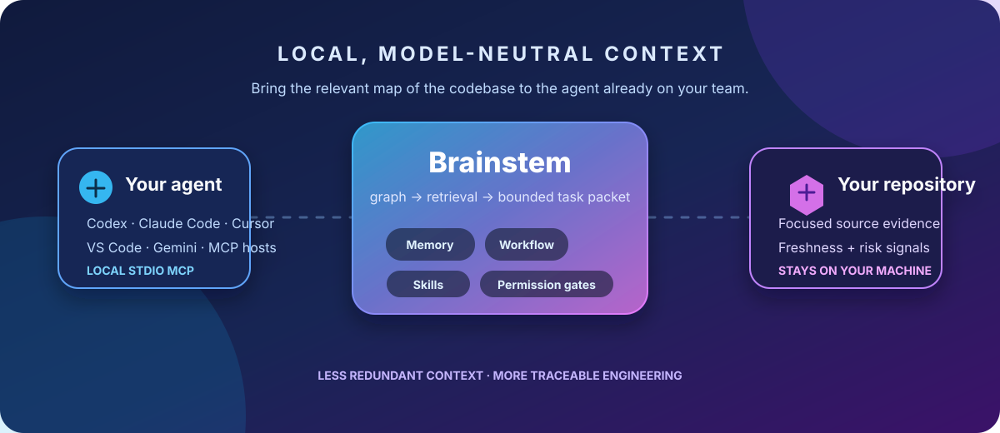

<!-- brainstem-readme-facts: mcp_tools=25; bundled_skills=997; skill_packs=92; hosts=6 -->
<!-- brainstem-readme-hosts: generic,codex,claude-code,cursor,vscode,gemini -->

  

<h1 align="center">Brainstem</h1>

  <strong>The local intelligence layer for agents that need to understand a real codebase.</strong> 
  Map the repository. Send the evidence. Keep the controls.

  
  
  
  
  
  

  
  
  
  
  
  

> <strong>Brainstem is not another hosted model or autonomous-agent wrapper.</strong> It is a local, model-neutral repository-intelligence and control plane that gives the coding agent you already chose the smallest current evidence set it needs to work well.

| <code>25</code> MCP tools | <code>6</code> configured hosts | <code>997</code> engineering guides | <code>92</code> skill packs |
| --- | --- | --- | --- |
| Every tool is permission-gated. | Codex, Claude Code, Cursor, VS Code, Gemini, and portable MCP. | Searchable, enableable, and measurable. | Broad domain coverage without dumping it all into context. |

---

## Built for the moment an agent meets a serious repository

<table>
  <tr>
    <td width="33%" valign="top">
      <h3>01 · Map, don't dump</h3>
      Brainstem indexes symbols and dependency edges for Python, JavaScript, TypeScript, Rust, Go, and Java. The agent starts from a ranked, explainable slice—not a blind whole-repository paste.
    </td>
    <td width="33%" valign="top">
      <h3>02 · Keep evidence fresh</h3>
      Task packets combine source excerpts, likely tests, repository rules, Git signals, risk flags, and source-linked memory. Stale memory is detected rather than quietly reused.
    </td>
    <td width="33%" valign="top">
      <h3>03 · Make completion defensible</h3>
      A durable workflow requires real design, plan, test, verification, and review evidence before high-confidence work can reach <code>complete</code>.
    </td>
  </tr>
</table>

<pre><code>your coding host
        │  local stdio MCP — no Brainstem HTTP service by default
        ▼
┌──────────────────────────────────────────────────────────────────┐
│ BRAINSTEM                                                        │
│ repository graph → focused retrieval → bounded task packet       │
│ local memory     → workflow gates    → permission + audit policy │
└──────────────────────────────────────────────────────────────────┘
        │
        ▼
your repository + local .brain/ state
</code></pre>

## The agent ecosystem—open by design

Brainstem gives each host the same local-stdio contract, rather than forcing a
model, cloud account, or IDE migration. It prints reviewable configuration; it
does <strong>not</strong> edit a host's settings behind your back.

| Agent / host | Ready path | What Brainstem adds |
| --- | --- | --- |
| <strong>OpenAI Codex</strong> | <code>.codex/config.toml</code> | Bounded repository evidence and explicit profiles |
| <strong>Claude Code</strong> | <code>claude mcp add-json</code> | Local MCP context, workflow, and retrieval tools |
| <strong>Cursor</strong> | <code>.cursor/mcp.json</code> | A focused project map instead of broad file loading |
| <strong>VS Code</strong> | <code>.vscode/mcp.json</code> | Portable, reviewable local server definition |
| <strong>Gemini CLI</strong> | <code>.gemini/settings.json</code> | The same model-neutral MCP surface |
| <strong>generic / any MCP host</strong> | portable <code>mcpServers</code> JSON | Copy/paste local command contract—no vendor lock-in |

<pre lang="bash"><code># Generate, inspect, then paste the least-privilege configuration you want.
uv run brainstem host config codex --path /path/to/repository --profile readonly

# For another host, generate a portable safe connection instruction.
uv run brainstem host connect-prompt --path /path/to/repository --profile readonly
</code></pre>

<strong>See the full 25-tool MCP surface</strong>

 

| Surface | Tools |
| --- | --- |
| <strong>Repository evidence</strong> | <code>describe_project</code> · <code>get_rules</code> · <code>query_context</code> · <code>get_context_bundle</code> · <code>prepare_task</code> · <code>find_related</code> |
| <strong>Memory & guides</strong> | <code>check_history</code> · <code>list_skills</code> · <code>list_skill_packs</code> · <code>list_agents</code> · <code>propose_agent_profile</code> · <code>record_decision</code> · <code>record_skill_usage</code> · <code>get_skill_usage_stats</code> |
| <strong>Team composition</strong> | <code>list_teams</code> · <code>get_team</code> |
| <strong>Evidence-gated workflow</strong> | <code>start_workflow</code> · <code>get_workflow_state</code> · <code>get_next_work_item</code> · <code>record_workflow_artifact</code> · <code>record_workflow_verification</code> · <code>run_workflow_verification</code> · <code>request_workflow_transition</code> |
| <strong>Controlled actions</strong> | <code>propose_capability</code> · <code>run_verification</code> |

All 25 tools are mapped in one reviewable permission table. A new connection
starts with the <code>readonly</code> profile; a tool without the required grant is
denied and recorded in the local audit trail.

## Agent roles with evidence, not autonomous-agent theater

Brainstem does not claim that a library of prompts is a thousand autonomous
agents. It provides a system for the host agent(s) you choose: named,
reviewable profiles; declarative teams; and a workflow engine that keeps roles
and evidence separate.

| Role | Next responsibility | Guardrail |
| --- | --- | --- |
| <strong>Explorer</strong> | Retrieve minimal current context | Read-only by default |
| <strong>Designer</strong> | Record a reviewed design | Standard/high-risk work cannot skip it |
| <strong>Planner</strong> | Bind implementation and test plans | Implementation waits for plan evidence |
| <strong>Implementer</strong> | Make one bounded change | Re-verification is required after implementation |
| <strong>Tester</strong> | Run configured verification | Only executed evidence can satisfy the gate |
| <strong>Reviewer</strong> | Approve or return work | High-risk review must be independent |
| <strong>Coordinator</strong> | Route the next work item | Hosts perform execution; Brainstem never silently spawns agents |

<pre lang="bash"><code>uv run brainstem agent propose "test and fix the OAuth callback" --path /path/to/repository
uv run brainstem workflow start "Fix the OAuth callback" --mode high-risk --path /path/to/repository
</code></pre>

## Context efficiency you can measure—not a made-up token percentage

The useful saving is avoiding redundant repository context while retaining the
source, tests, rules, and dependencies the task actually needs. <code>prepare</code>
builds a capped task packet; <code>evaluate</code> measures it against labelled local
tasks.

<pre><code>context reduction = 1 − (complete task-packet characters / indexed-source characters)
</code></pre>

The report includes Recall@k, first relevant rank, packet size, indexed source
size, and the measured reduction. It deliberately does not turn characters
into fictional provider-token totals. On very small repositories, the whole
safe source set can be shorter than structured metadata; <code>--context-mode auto</code>
chooses the smaller safe option instead of fabricating a saving.

<pre lang="bash"><code>uv run brainstem init --path /path/to/repository
uv run brainstem index --path /path/to/repository
uv run brainstem prepare "trace the login redirect bug" --path /path/to/repository
uv run brainstem evaluate --path /path/to/repository --cases /path/to/private-cases.json
</code></pre>

## 997 targeted engineering guides, selectable instead of overwhelming

The bundled catalog is a guide library—not material automatically injected into
an agent context. A profile can restrict visible guides; any guide can be
enabled or disabled; and usage outcomes can be recorded locally to find which
guidance actually helps your team.

<pre lang="bash"><code># Browse only names/counts, then open one domain when it is relevant.
uv run brainstem skills --packs --path /path/to/repository
uv run brainstem skills --pack security-owasp --path /path/to/repository
</code></pre>

<strong>Browse every bundled guide pack (92)</strong>

 

<strong>Frontend & mobile</strong>

<code>accessibility-wcag</code> · <code>angular</code> · <code>css-layout-debugging</code> · <code>flutter-dart</code> · <code>frontend-react</code> · <code>pwa-offline</code> · <code>react-native</code> · <code>svelte-sveltekit</code> · <code>vue-nuxt</code> · <code>web-performance-vitals</code>

<strong>Backend & API</strong>

<code>api-versioning-strategy</code> · <code>authentication-authorization-patterns</code> · <code>backend-api-design</code> · <code>background-job-systems</code> · <code>dotnet-aspnet</code> · <code>go-backend-services</code> · <code>grpc-protobuf</code> · <code>java-spring-boot</code> · <code>nodejs-express</code> · <code>php-laravel</code> · <code>python-async-concurrency</code> · <code>ruby-rails</code>

<strong>Data, search & streaming</strong>

<code>data-pipelines-airflow-dbt</code> · <code>data-postgres</code> · <code>data-warehouse-query-optimization</code> · <code>dynamodb-nosql</code> · <code>elasticsearch-search</code> · <code>kafka-streaming</code> · <code>mongodb-nosql</code> · <code>mysql-specific</code> · <code>redis-deep</code>

<strong>Cloud, platform & delivery</strong>

<code>aws-failure-modes</code> · <code>azure-failure-modes</code> · <code>bazel-build-system</code> · <code>cicd-pipeline-design</code> · <code>cloud-cost-optimization</code> · <code>gcp-failure-modes</code> · <code>helm-kubernetes-packaging</code> · <code>incident-response-oncall</code> · <code>infra-containers-k8s</code> · <code>monorepo-turborepo</code> · <code>serverless-lambda-patterns</code> · <code>service-mesh-istio</code> · <code>terraform-iac-deep</code>

<strong>Security & governance</strong>

<code>api-security-deep</code> · <code>cloud-security-posture</code> · <code>compliance-gdpr-soc2</code> · <code>container-security</code> · <code>penetration-testing-methodology</code> · <code>sast-dast-tooling</code> · <code>secrets-management-vault</code> · <code>security-owasp</code> · <code>supply-chain-security</code> · <code>threat-modeling</code>

<strong>Testing & quality</strong>

<code>contract-testing-pact</code> · <code>cypress-e2e</code> · <code>load-performance-testing</code> · <code>mutation-testing-quality</code> · <code>qa-playwright</code> · <code>test-data-management</code> · <code>unit-testing-java</code> · <code>unit-testing-javascript</code> · <code>unit-testing-python</code>

<strong>AI, retrieval & agent reliability</strong>

<code>agent-tool-calling-reliability</code> · <code>llm-prompt-engineering-pitfalls</code> · <code>ml-data-pipeline-quality</code> · <code>ml-model-serving-inference</code> · <code>ml-monitoring-drift-detection</code> · <code>ml-training-fine-tuning-pitfalls</code> · <code>rag-retrieval-debugging</code> · <code>vector-database-tuning</code>

<strong>Systems & performance</strong>

<code>caching-strategy-design</code> · <code>concurrency-race-conditions</code> · <code>distributed-systems-consistency</code> · <code>graphql-deep</code> · <code>memory-leak-diagnosis</code> · <code>observability</code> · <code>performance-profiling-methodology</code> · <code>websockets-realtime</code>

<strong>Engineering practice & product</strong>

<code>cli-tool-design</code> · <code>code-review-heuristics</code> · <code>dependency-upgrade-strategy</code> · <code>desktop-electron-apps</code> · <code>email-deliverability</code> · <code>general</code> · <code>golang-idioms-pitfalls</code> · <code>legacy-code-migration</code> · <code>localization-i18n</code> · <code>payment-processing-billing</code> · <code>python-packaging-dependency-hell</code> · <code>rust-systems-programming</code> · <code>typescript-type-system</code>

## Security is a boundary, not a footnote

| Concern | Brainstem control |
| --- | --- |
| Source exposure | Local filesystem state and local stdio MCP; no Brainstem HTTP service by default. |
| Agent capability creep | <code>readonly</code> default plus explicit READ, WRITE, EXECUTE, NETWORK, INSTALL, DATABASE, DEPLOY, DELETE, and SECRET grants. |
| Sensitive file leakage | Bounded packets skip sensitive filenames and cap fallback source reads. |
| Stale decisions | Memory can be linked to source hashes; stale references are excluded from future packets. |
| Unverifiable completion | Workflow completion needs executed verification after the most recent implementation and an approved review. |
| Isolated verification | Optional Docker verification is fail-closed: digest-pinned image, read-only source mount, no network, non-root user, dropped capabilities, <code>no-new-privileges</code>, and resource limits. |
| Supply-chain visibility | Locked Python dependency graph, deterministic SBOM generation, CodeQL, Dependabot, secret scanning, push protection, and release checks. |

Brainstem is not a compliance certification and does not replace your access
controls, code review, or secure-development program. It makes those controls
available to the local agent boundary rather than hiding them behind prose.

## Install, connect, and prove it locally

### Source installation

Brainstem requires Python 3.11+ and <a href="https://docs.astral.sh/uv/">uv</a>.

<pre lang="bash"><code>git clone https://github.com/faizalmunna/brainstem.git
cd brainstem
uv sync --extra dev
uv run brainstem --help
</code></pre>

### Docker runtime

The runtime image uses the locked dependency graph and an unprivileged user.

<pre lang="bash"><code>docker build --tag brainstem:local .
docker run --rm brainstem:local --help
</code></pre>

To use it against a project, mount only that project. Indexing writes local
<code>.brain/</code> state, so its mount must be writable.

<pre lang="bash"><code># PowerShell
docker run --rm -it -v "C:\path\to\project:/workspace" brainstem:local init --path /workspace
docker run --rm -it -v "C:\path\to\project:/workspace" brainstem:local index --path /workspace

# bash/zsh: preserve ownership of generated files
docker run --rm -it --user "$(id -u):$(id -g)" -v "$PWD:/workspace" brainstem:local index --path /workspace
</code></pre>

### npm launcher

The scoped npm package is an installer/launcher for the locked Python runtime,
not a second Node.js implementation. It remains intentionally unpublished
until the maintainer explicitly completes registry authentication.

<pre lang="bash"><code># Available after the first public npm release:
npm install -g @faizalmunna/brainstem
brainstem --help
</code></pre>

### Verification commands

<pre lang="bash"><code>uv lock --check
uv run pytest
uv run brainstem release check --path .
</code></pre>

The release gate fails closed when repository identity, a security reporting
channel, dependency locking, or supply-chain controls are missing. Version
tags wait for Windows, Linux, macOS, npm-install, and Docker checks before
release artifacts are built and attested; publication remains an explicit
maintainer action.

## Public boundaries

- Security reports: <a href="https://github.com/faizalmunna/brainstem/security/advisories/new">private GitHub vulnerability reporting</a>
- Source and issues: <a href="https://github.com/faizalmunna/brainstem">github.com/faizalmunna/brainstem</a>
- Public repository content excludes private development notes, local plans,
  transcripts, credentials, and private evaluation cases.

See <a href="SECURITY.md">SECURITY.md</a> for reporting and release controls.

## License

<a href="LICENSE">MIT</a>
